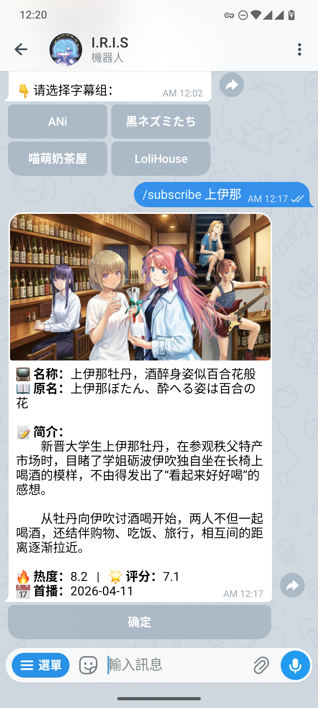
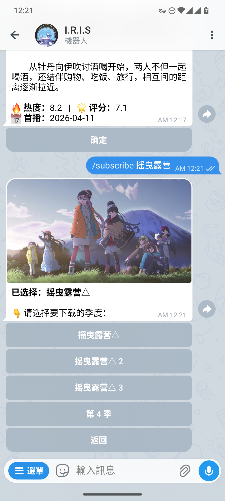
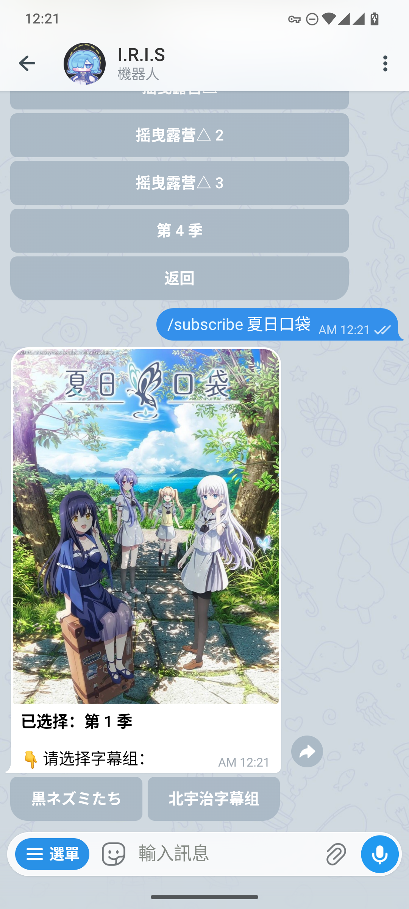
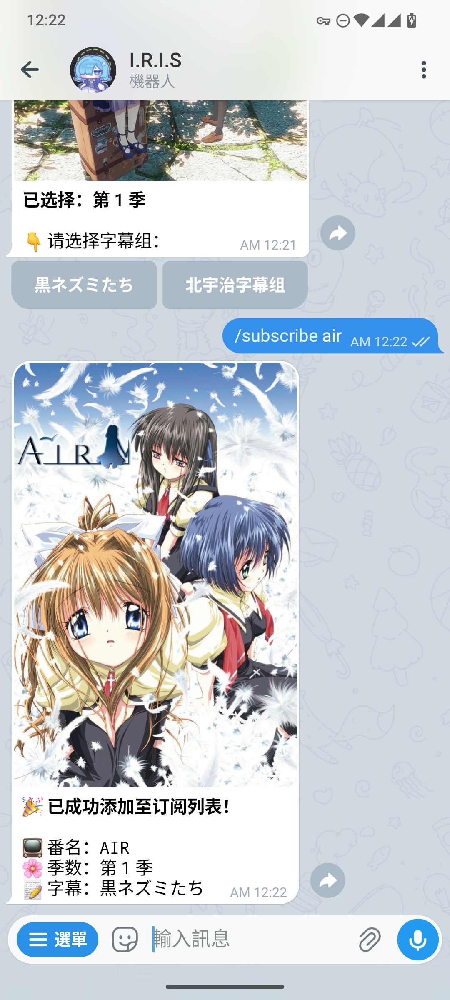
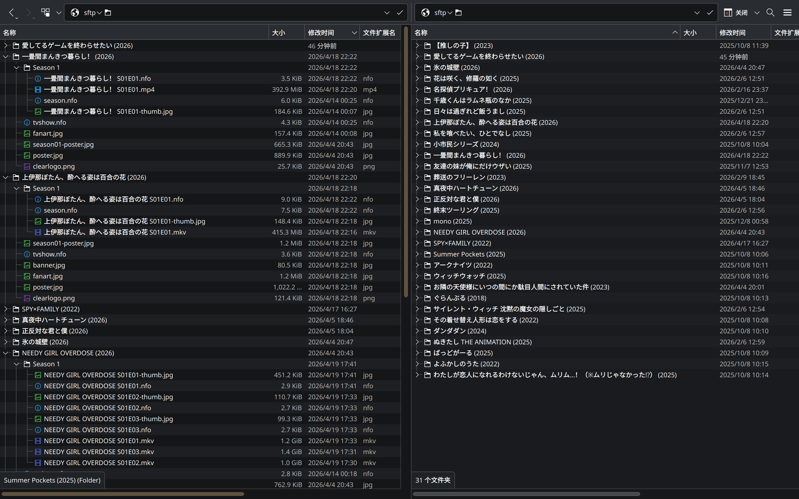

# Shinban Sync - 新番同步

[](https://opensource.org/licenses/Apache-2.0)
[](https://github.com/clash-verge-rev/clash-verge-rev)


> 项目早期开发中，有任何功能和代码的问题欢迎提交 ISSUE

**Shinban Sync** 是可以进行无感知追番与媒体库整理的工具。

它可以帮你全自动检索、下载、重命名并归档你订阅的新番，还提供了一个 Telegram 机器人，让你通过手机就能完成从 **搜索番剧 ->
查看详情 -> 选择字幕组 -> 添加到订阅库** 的一条龙操作。

适合配合 **Emby / Jellyfin / Plex** 等媒体服务器使用，为你打造最纯净的本地/云端动漫媒体库。

## Features

- [x] **🤖 交互式订阅**：通过关键词搜索，可以查看系列海报、简介、季度信息，然后选择喜欢的字幕组添加到订阅配置。
- [x] **⏱️ 自动追赶进度**：根据番剧首播时间和当前日期自动计算“应有进度”。哪怕你半途才想起追番，也可以一次性把落下的所有集数补齐。
- [x] **🗂️ 重命名与归档**：支持自定义的 `<var>` 变量命名模板。
- [x] **☁️ 多存储提供者支持 (Storage Providers)**：
    - `Local`：支持本地全自动整理。
    - `SFTP`：支持远程 NAS、VPS 媒体库归档。
    - `OpenList`：支持通过 OpenList API 直接管理挂载的网盘。
- [x] **📦 Docker 容器支持**: 提供了 `Dockerfile` 及 `Docker Compose` 配置，方便服务器部署。
- [ ] **更多下载器接入**：目前支持 `Aria2`，后续将逐步接入如 `qBittorrent` 支持。
- [ ] **更多 Bot 命令**: 目前支持添加订阅，后续将逐步加入新番通知，删除订阅的支持。
- [ ] **更多资源站接入**：目前支持 `ACG.RIP`，后续计划接入 `蜜柑计划 (Mikan Project)` 等更多优质 RSS 源。
- [ ] **文件覆盖选项**：针对“重发修正版 (v2)”资源的自动替换机制。
- [ ] **合集资源整理**: 对非单集的季度合集进行整理 (新番下载貌似用不到这个，但是秉承着你可以不要，我不能没有，得加😂)

## Example `config.yml` Config

在项目的根目录（或任意你喜欢的位置）创建一个 `config.yml` 文件。
你可以复制以下模板并根据自己的需求进行修改：

```yaml
# 1. 令牌配置 (如果不需要使用 Telegram 机器人则无需填写)
telegram_bot_token: your_bot_token  # 查询 @BotFather 来获取你的机器人令牌
telegram_user_id: your_user_id      # 可以使用 @userinfobot 获取你的用户ID。此参数确保机器人只能和你对话，防止滥用
tmdb_token: your_tmdb_token         # 在 https://www.themoviedb.org/settings/api 获取 API 读访问令牌
# 2. 下载器配置
downloader:
  provider: aria2
  aria2:
    base_url: http://127.0.0.1:6800/jsonrpc
    token: your_secret_token
# 3. 存储配置，用于处理下载的番剧
storage:
  # 启用的存储提供者: "local", "sftp", "openlist" 三选一
  # "local" 适用于在服务器上部署或纯本地使用；另外两个适用于在不同终端上运行，通过远程访问服务器管理资源
  provider: local
  # 命名模板，标签内可以直接写 Python 语法（如果保持默认值则无需显式指定），支持传入的标签如下：
  # <filename>, <subtitle>, <first_air_date>, <season_year_date>, <season>, <episode>, <language>, <ext>
  folder_name_pattern: <filename> (<first_air_date.year>)/Season <season>
  video_name_pattern: <filename> S<season:02d>E<episode:02d>.<ext>
  # 如果 provider: local 只保留这部分就可以
  local:
    aria2_path: /aria2/path
    target_path: /target/path
  # 如果 provider: sftp 只保留这部分就可以
  sftp:
    host: 192.168.1.100
    port: 22
    user: root
    password: your_password
    pub_key: ''  # 填写密钥的文件路径
    aria2_path: /aria2/path
    target_path: /target/path
  # 如果 provider: openlist 只保留这部分就可以
  openlist:
    base_url: https://example.openlist.com
    user: user
    password: password
    aria2_path: /aria2/path
    target_path: /target/path
# 4. 追番订阅列表
anime:
  # 如果你配置了机器人与 TMDB 的密钥，这里可以留空来让机器人自动配置
  # 样例如下：
  - search_keyword: 上伊那牡丹，醉姿如百合     # (必要) 这个字段用于在 ACG.RIP. 上筛选字幕组的发布内容，确保字幕组发布标题包含关键词
    filename: 上伊那ぼたん、酔へる姿は百合の花   # (必要) 这个字段用于创建本地文件夹以及视频的重命名
    subtitle: 拨雪寻春                      # (必要) 好歹用一个字幕组吧，一部番用几个字幕组东拼西凑观感会很割裂
    season_air_date: '2026-04-11'          # (必要) 本季上映时间，用于文件命名和集数判断
    first_air_date: '2026-04-11'           # (*可选) 初次上映的时间，用于默认规则下文件夹命名。如果季号为 1 可以不填，否则需要填
    season: 1                              # (可选) 选定的季号，默认 1
    episode_count: 12                      # (可选) 不包括半集的总集数，默认 12
    language: chs                          # (可选) 简中 chs, 繁中 cht，默认 'chs'
```

## Running

### 手动配置

首次使用时可以在创建好虚拟环境后运行如下代码安装依赖。

```bash
pip install -r requirements.txt
```

使用 Python 运行主程序 `main.py`。你可以自由调整组合参数来决定脚本的工作模式。

```bash
# 最常用的启动命令：同时启动 Telegram 机器人，并在后台开启 24小时/次 的循环检索
python3 -m src.shinban_sync.main -b -l
```

#### 所有支持的启动参数：

| 参数缩写 | 参数全称         | 作用说明                                                                   |
|:-----|:-------------|:-----------------------------------------------------------------------|
| `-b` | `--bot`      | **启动 Telegram 机器人**。开启后可以通过 TG 搜番和添加配置。                                |
| `-l` | `--loop`     | **开启常驻循环模式**。程序将挂在后台定期检查新番更新，如果不加此参数，程序只会执行一次检索然后退出。                   |
| `-i` | `--interval` | **设置循环间隔(秒)**。必须配合 `-l` 使用。默认 `86400` (即 24 小时)。例如 `-i 3600` 代表每小时查一次。 |
| `-c` | `--config`   | **显式指定配置路径**。例如 `-c /etc/shinban/config.yml`。未指定时在当前/根目录寻找。            |

### 使用 Docker

项目已发布官方 Docker 镜像用于部署在服务端，只需以下几步即可运行：

1. **准备配置文件**：在需要部署的服务器上新建一个空目录（例如 `shinban`），并在其中创建一个配置文件（例如 `config.yml`
   ），参考上方模板修改后保存。
2. **创建 docker-compose.yml**：在同一目录下创建 `docker-compose.yml`，根据项目模板按实际场景修改后保存。
3. **启动容器**：

   ```bash
   docker-compose up -d
   ```

## Screenshot

### 交互式订阅

<table>
  <tr>
    <td></td>
    <td></td>
  </tr>
  <tr>
    <td></td>
    <td></td>
  </tr>
</table>

### 媒体库重命名

根据用户配置的模板，磁链下载的文件会被组织进模板路径中，被媒体服务器识别刮削。

<table>
  <tr>
    <td></td>
    <td></td>
  </tr>
</table>

## Licenses

本项目使用 `Apache License 2.0` 协议，仅供学习交流，请于下载后24小时内删除，使用应遵循当地法律法规，请勿用于违法用途。

```text
Copyright 2026 wiseCirno

Licensed under the Apache License, Version 2.0 (the "License");
you may not use this file except in compliance with the License.
You may obtain a copy of the License at

    http://www.apache.org/licenses/LICENSE-2.0

Unless required by applicable law or agreed to in writing, software
distributed under the License is distributed on an "AS IS" BASIS,
WITHOUT WARRANTIES OR CONDITIONS OF ANY KIND, either express or implied.
See the License for the specific language governing permissions and
limitations under the License.
```
